# 了解Virtools

要想了解Ballance制图，就必须从了解基础的工具入手。对Virtools的初步了解是学习Virtools制图的第一步，我们从这里开始了解Virtools（之后简称VT）。

## VT的注册与初始界面

各种版本的Virtools直属文件夹里面都有个“Dev.exe”（其实真正的VT程序是devr.exe ，Dev.exe 只不过是到真正VT程序的链接程序，是习惯上的打开方式。如果兼容性有误，需要设置devr.exe的属性，兼容模式设成Windows XP (Service Pack 3) 即可），打开后需要去注册。

注册时它会给你两个选项，选择第二项“specify the licence file”，意为寻找注册文件，之后弹出的框中，点击方框下的“Browse”，浏览目录，找到你通过各种途径下载的文件“license.dat”（或license.lic，授权文件的名称也可能是licence等其他名称），并且选择，确认，即注册完成。（注意：注册时的第一项需要输入注册码，目前尚未找到可用注册码，因此不可行）

另外因为不同版本VT对授权文件的信息要求不同，所以换用不同版本的Virtools时，需要手动更改下授权文件对应版本，否则就会显示授权文件有误，而无法打开其他版本的VT。不过如果用了三版本（3.0、3.5、5.0）通用的授权文件，就不用考虑这个了。

Virtools 3.0是现有最适合制图的版本，但多数电脑尤其是win8/10注册3.0版本很容易抽风，因此用3.5版本制图更加广泛，不过3.5版本也存在一些电脑打不开的问题。Virtools 5.0做出来的图无法被Ballance识别，加载时会卡进度条，但是用3.0或3.5版本的Virtools打开并保存一次即可正常加载。5.0版本虽然“不适合制图”，但在一些其他方面有用（如能实现导出obj而与3ds Max交流的插件vt2obj，这里不再介绍），而且兼容性最好。Virtools 5.0打不开的情况可以尝试通过安装一个适配自己电脑的DirectX修复器解决。

注册完成后，要想修改Ballance地图，需要先了解Virtools的界面。首先说明一点，目前暂未能找到汉化版的VT，但是其实基本不需要英文能力——VT的英文并不是非常难懂，而且很多是缩写，英语好的人也不一定能理解。何况适用于制图的操作熟悉的是方法，记住怎么用对应功能即可，因此英文版的VT用习惯了也就适应了。

接下来让我们看看初次打开VT后的界面效果以及建议做的第一步操作：

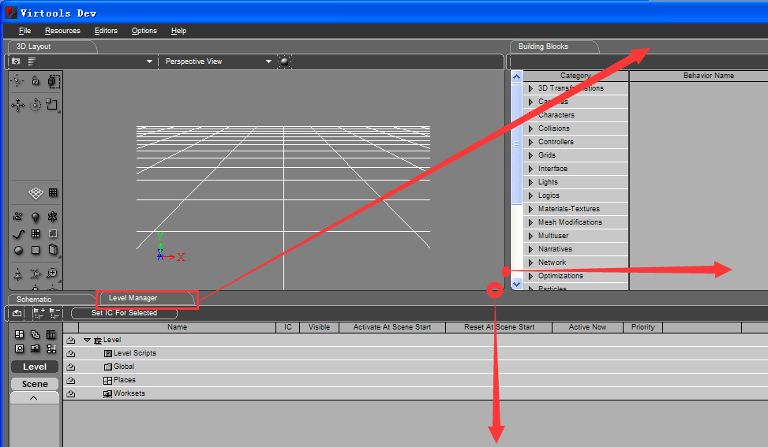
 
我们会看到这样的景象——屏幕被分成了三栏，左上默认是3D Layout选项卡（以后简称3D框），主要用于效果演示与输出；右上默认是Building Blocks选项卡（简称BB列表），用于查找脚本，对于制图用处不大。下侧默认是Level Manager选项卡，是主要检索关卡元素的一栏，非常重要。3D框看起来有点小了，可以先拉大一点，按住边界拖动就行了。Level Manager选项卡里的元素在制图时会显示很多，又因为右边初始的BB列表对于制图用处不大，所以可以把Level Manager框拖动到右上一栏（按住“Level Manager选项卡”拖动即可），这样后续处理会方便得多，另外，双击选项卡会切换该选项卡为全窗口显示，再双击又会回归之前调好的界面。这样操作后，我们看到的便是这样了：

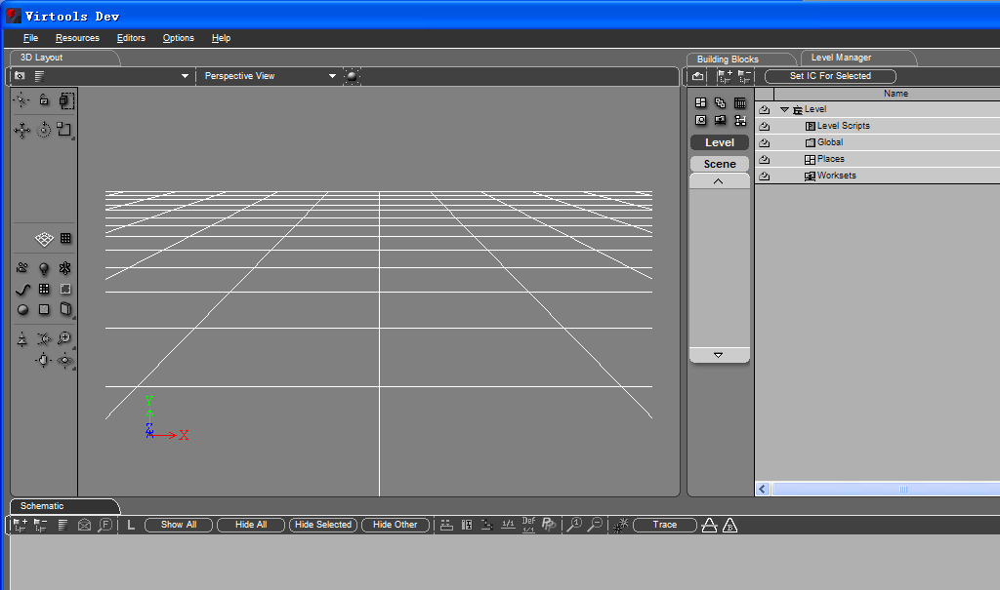
 
不过每次打开VT后都可能得重新进行拖动Level Manager的操作，习惯即可，这样对制图相对比较方便。

## 地图的导入与导出

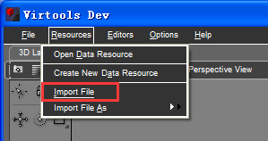

我们知道，Ballance的地图文件的格式是nmo，但是VT中却只能打开cmo文件。别急，其实nmo文件也是VT可识别的文件，只不过是以VT素材的形式而不是VT关卡的形式出现的。VT关卡的默认格式是cmo，而最支持的素材的默认格式是nmo。所以我们要以导入素材的形式打开nmo文件，具体操作如右图。

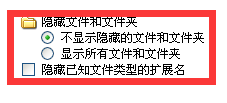

Ballance地图其实是伪装成nmo格式的cmo文件（进一步研究表明，由于cmo不仅支持地图，还支持动画，而nmo是场景中静态对象的最好载体，所以地图对外用的是nmo格式，不过改成cmo来编辑确实能带来不少便利），所以可以把要编辑的自制地图扩展名直接
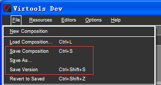
改成cmo，用VT编辑完后直接以cmo的形式保存，要玩的时候再改成nmo。如果你的电脑把cmo设成VT默认编辑文件并且隐藏扩展名，试试设置文件夹选项（这个不同系统各异，在这里不作介绍），显示已知文件类型的扩展名即可修改扩展名。

地图直接以cmo形式保存有三种保存形式：Save Composition、Save As…和Save Version。 Save Composition相当于通常我们编辑文档用的“保存”，Save As…相当于通常我们编辑文档用的“另存为…”，而Save Version比较特殊，直译为保存版本，Save Version可以保存修改后的地图，同时不替换修改前的地图。

举个例子，当打开一个名为“2HAD.cmo”的地图文件并编辑修改后，用Save Version可以新保存一个名为“2HAD_01.cmo”的地图文件，而原先没被改动的文件依然能被保存，同理这样还可以保存“2HAD_02.cmo”、“2HAD_03.cmo”等文件，如图所示。

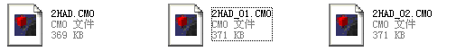

注意：原版地图与绝大多数自制地图不一样，不能通过改成cmo直接打开的方式打开，否则会出错。请用导入nmo文件的方法导入，保存以后就可以随意用cmo文件的编辑方法了。

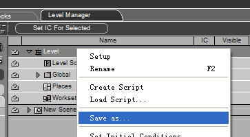

地图也可以直接导出成nmo格式，只需在Level Manager中的根目录Level上点右键“Save As…”即可，如图所示：

我们还会遇到一类nmo文件。这些文件不是关卡，也不是游戏里面特殊的配置文件，这些文件被称为素材。素材的导入应该使用本节第一段的方法。关于素材的导入和导出有较深的学问，此处不再讨论，详见本书第三章第3节。

## 一些基本操作

我们将沿用本章第1节调整过后的界面对本节内容进行介绍。有一个不方便的是，每次打开VT都需要你去把界面调整成那样，但是这些无关紧要，调了还是为了编辑地图的方便。让我们再一次观察一下导入地图之后的VT界面：

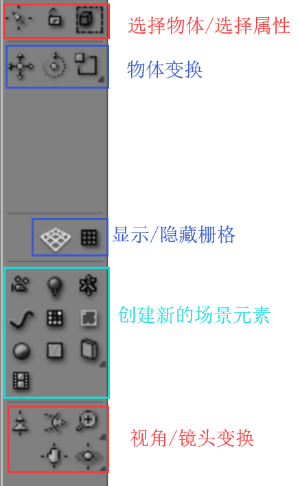

为什么什么都没有？其实这不是你的错。每次打开VT后，3D框中都会把你的视角位置调成虚拟世界的最中心，但是不是所有地图都有在最中心的物体。要想找到地图物体，需要你进行换视角位置等的一系列操作。3D框左边的一系列图标相当于工具栏，左图为各分区图标的大体作用。

如下是对这些小图标中常用图标的详细介绍：

* 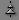：选此图标后，鼠标回到3D框内，按住鼠标往下或上挪，镜头就会扩张或缩小，一般遇见未知地图可用此图标放大视野来找到地图。
* 和：隐藏或显示VT界面里默认给的栅格，觉得默认栅格碍事的改图者可以用这两个图标隐藏。 
* 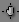：选此图标后，鼠标回到3D区域，可以移动镜头。 
* 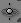：以环绕的方式调整镜头的工具。当你未选中任何东西时，用这个工具旋转相当于围绕坐标中心旋转，这种不选中物体的旋转一般不常用，因为镜头会乱跑。但是如果选中了物体后再用这个工具，拖动鼠标，镜头便会绕着这个物体旋转。可以试试在上按住鼠标，会出来几个选项：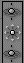，拖动鼠标至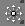上，松开，就变成了。这时使用这个工具，将直接旋转摄像机的方向。
* ：用于视角前后移动，与功能相似。但是如果按住鼠标改为后，选中物体后点击，则会将视角自动移动至刚好能够容纳该物体的位置。此功能比较有用，有时可以快速定位物件/在3D框场景中瞬移。
* 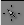：选定物体；鼠标拖动可选定涉及区域内的批量物体；按住Ctrl键配合这个使用可以选择性的选定多个物体，此时需要了解一件事：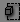指的是只要选择框选到了该物体的一部分即可选中该物体。此操作极易引起误选，因此建议点击一下改为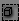。此时，只有物体完全处于选择框内，该物体才会被选中。不过还是建议在选中后点击查看一下是否存在误选。

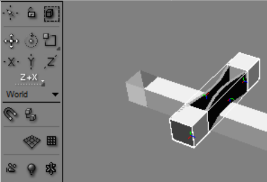

* 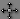：移动物体。在选中物体后，可以选择移动物体的基准坐标轴或两个坐标轴形成的平面。 例如下图所示的物体的移动，选择Z+X平面后物体只能在Z+X平面移动，而物体不会在Y轴方向移动。

* 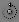：旋转物体，和移动物体相似，可以选择基准坐标轴或平面进行旋转，不过旋转物体选择的基准轴或平面较难确定。我们可以点击，使其变成，这样就可以锁定单次旋转角度，旋转时幅度只能旋转设定角度的整数倍（设定角度默认是10°，可以自己在该按钮上右键调整为任何想要的角度 [参数名为Rotate Step] ，建议调成22.5°），这样可以准确的旋转物体。此外，旋转选定的多个物体时还可以调整旋转方式，可以选择物体绕各自轴旋转，也可以选择绕公共轴旋转。
事实上我们在本书的下一章就会学到如何通过具体调整物件参数来移动或旋转物体。 
* 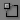：扩大或缩小物体。此工具在Ballance地图修改或编辑过程中一般不常用，且容易出现一些问题。需要强调的是，对物体使用这些操作时必须鼠标放在物体上，否则容易出现误选物体等操作问题，此时可以通过点击把需要操作的物体锁住，此时点击屏幕中任意位置均可对该选中物体操作。
* ：在镜头视野前方放置一个灯泡。利用此工具可以给地图进行照明，但是灯泡毕竟不是游戏中固有的元素，而且含有灯泡的地图可能会出现其他不太好的影响，所以在照明完后应当删除灯泡（严格地说应该把灯泡称作点光源，这只是光源的一种，我们将在本书第三章第4节详细了解光源）。

至于其他的工具，对编辑和修改Ballance地图帮助效果不大或过于复杂，此处不再介绍，有兴趣的可以自行探索。

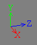为坐标轴，代表地图空间中的三个方向，这是定位物体的基础。接下来的镜头变换内容中我们可以看到坐标轴的展示发生了与镜头变换相应的一些变化。

另外，右键点击3D框后弹出的菜单中可以选择不同类型的镜头，如图所示：

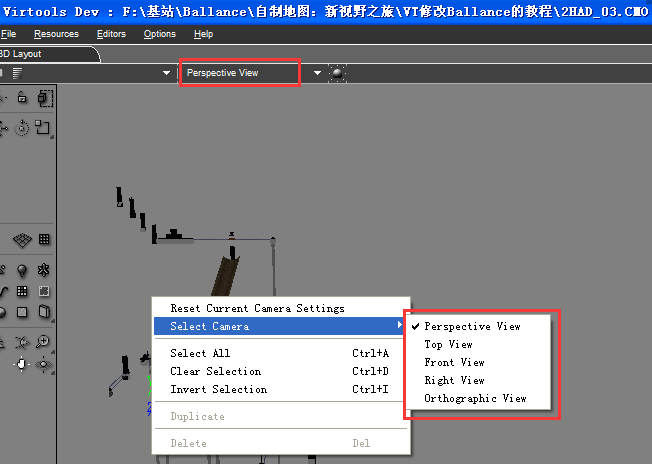
 
默认镜头是Perspective View，译为透视视图。透视视图存在消失点，能体现远小近大的规律，是我们美术上用的视图形式，也是我们身临其境时眼见的真实视图形式。这是我们最常用的镜头。我们可以发现镜头的状态在图上标出的红色框中有显示。我们可以通过右键换其他镜头来实现对地图的精准编辑。

Top View是“俯视图”的意思，即从上往下看，选用该镜头可以准确调整物体在X+Z平面的位置，但无法调整Y轴位置（即竖直方向的位置）

同理，Front View和Right View分别表示正视图和右视图。利用它们，我们也可以较为准确的对准物体相对于与坐标轴平行或垂直的平面的位置。

Orthographic View是正交视图的意思，当Top/Front/Right视图经过等能改变视图中坐标轴方向的变换后，3D框的镜头就会立刻转变为正交视图。正交视图中所有网格线平行，是我们数学上用的视图形式，因此上述操作有利于观测和检验用标准视图对准后的物体的位置。作图时惯用这个镜头可能有些违和感，尤其是柱子很多的地图。当再用Top/Front/Right视图的时候再次用变换镜头，Orthographic View的镜头位置就会瞬间改变。当刚进入地图且没有上述所说的镜头变换时，Orthographic View展示是效果与Top View保持一致。

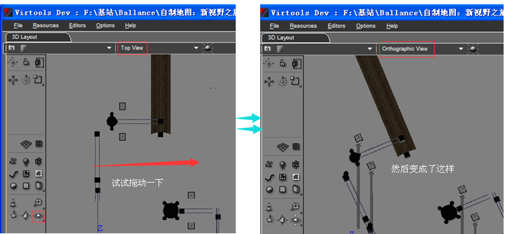
 
另外，我们还可以利用一些快捷键来实现一些便捷操作：

* 滚动鼠标中轴：放大或缩小视野（放大视野有一定的限度，可以先缩小然后用 放大，就可以提高滚动鼠标中轴放大视野的限度）；
* 在VT界面中点击键盘上的Y键，视角可以根据鼠标在同一高度内自由转动。如果想提高/降低视角，点击鼠标右键拖动；如果想转的快一些或者到其他高度，使用鼠标左键。不过需要注意的是，视角移动速度取决于按Y键时鼠标在画面内的位置。鼠标越远离初始位置，视角移动速度就越快。

* 按住鼠标中轴并移动鼠标：移动镜头

* 按alt再按住鼠标中轴并移动鼠标：绕某个中心旋转镜头，（刚打开一个界面时旋转中心是坐标中心）。

* ctrl+z：撤销，但只能撤销在3D框中进行的操作，之后学到的Level Manager操作中就用不了撤销操作了，所以需要谨慎。

